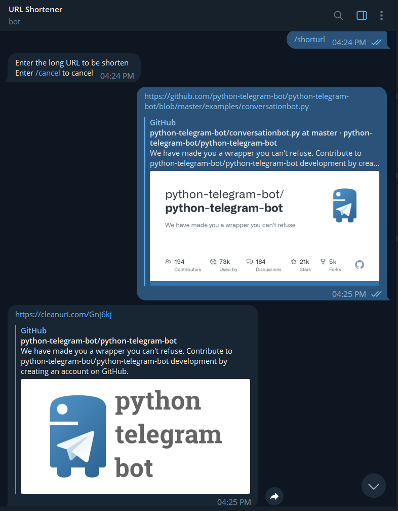

#  <p align="center">URL Shortner Bot
<p align="right">
<a href="LICENSE">
    
</a>
</p>

This Telegram Bot receives a url from the user and shorten it using [cleanuri.com](https://cleanuri.com/)'s API.

## ✨ How it Works
You have to initialize by `/start` command. Enter `/help` for list all command. To shorten the URL enter the command `/shorturl`.
<p align="center">
  
</p>

## 🚀 Usage

### Prerequisites

It is presumed that you have obtained an API token with [@BotFather](https://core.telegram.org/bots#botfather). We will call this token `TOKEN`.
Furthermore, you have basic knowledge of the Python programming language and more importantly the [Cleanuri.com API](https://cleanuri.com/docs).

### Installation

You need to install two python package : `python-telegram-bot`, `request`.
```bash
pip install python-telegram-bot request
```
### Things to Change
You should modifiy this line with respect to your bot `TOKEN`
```python
updater = Updater(<YOUR BOT TOKEN>, use_context=True)
```
and also remove this line.
```python
import os
```
#### Note:
I wrote this script to be executed by GitHub Action. If you tend run script in your mechine make the above changes.

### <p align="center">or
If you wish to run on GitHub, Fork this repository and then just add a [Repository Secrets](https://docs.github.com/en/actions/reference/encrypted-secrets#creating-encrypted-secrets-for-a-repository). 
Your secrets name must be `BOT_TOKEN` and value to be of your bot `Token`.

#### Note:
There is a limitation for everything. GitHub Action cancels a run after 6 hrs. However you can increase the run time by having multiple run in a workflow.
Your also limited by GitHub Actions run time which differ for each [product](https://docs.github.com/en/github/getting-started-with-github/learning-about-github/githubs-products)
(for `Pro` it is 3000 mins/month). Make sure you use your time wisely.

## 📝 License

Copyright © 2021 [Dharun A P](https://github.com/Dharun-palanisamy).<br />
This project is [MIT](LICENSE) licensed.
